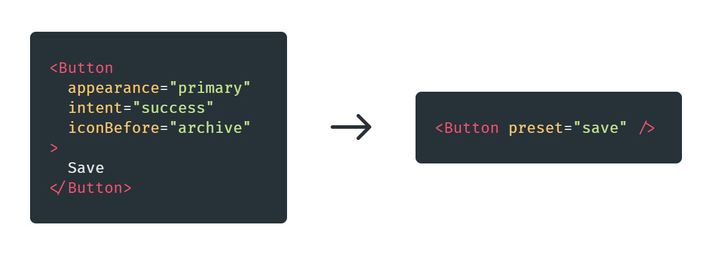

# React Preset

> Smash your props into single `preset` prop.



## Quick start

```sh
npm install react-preset
```

1.  Create preset object and extend TypeScript definitions:
```tsx
// preset.tsx
const preset = {
  button: {
    save: {
      children: 'Save',
      appearance: 'primary'
    },
    cancel: {
      children: 'Cancel',
      appearance: 'minimal'
    }
  }
}

declare module 'react-preset' {
  export interface DefaultPreset extends Required<typeof preset> {}
}

export default preset
```

2. Wrap your App component with preset provider
```tsx
// App.tsx
import {PresetContext} from 'react-preset'
import Button from './Button'
import preset from './preset'

const App = () => (
  <PresetContext.Provider value={preset}>
    <Button preset="cancel" />
    <Button preset="save" />
  </PresetContext.Provider>
);
```

3. Wrap your component with `withPreset`

```jsx
// Button.tsx
import * as React from 'react'
import {withPreset} from 'react-preset'

type Props = {
  appearance: 'minimal' | 'primary'
}

const Button: React.FC<Props> = (props) => <button {...props}/>

export default withPreset('button')(Button)
```


Check [example directory]('./example) to learn more.


## API

### `PresetContext`
Used to provide presets to components.

```tsx
<PresetContext.Provider value={preset}>
  <Page />
</PresetContext.Provider>
```

### `usePreset`
Hook used to get access to all presets inside component.

```tsx
const MyComponent = () => {
  const presets = usePreset()
  // presets.button.save
}
```

### `withPreset(groupName)(component)`
Apply preset to component.

```tsx
const Card = () => <div {...props} />

export default withPreset('card')(Card)
```


